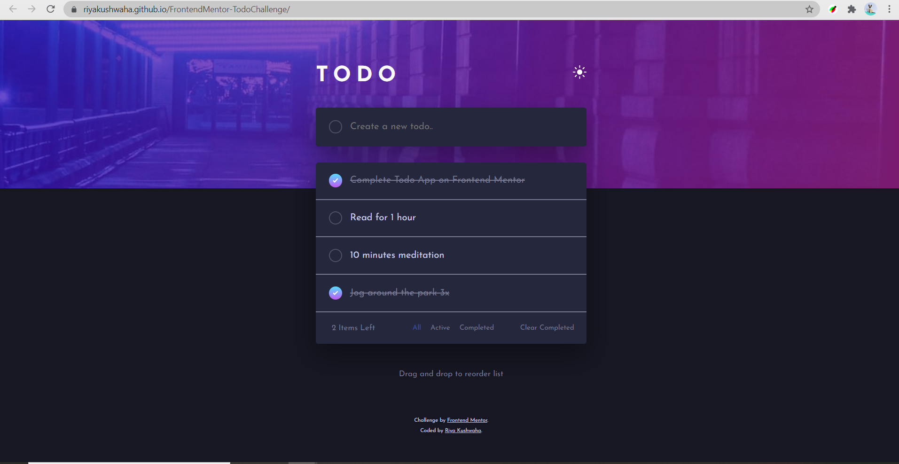
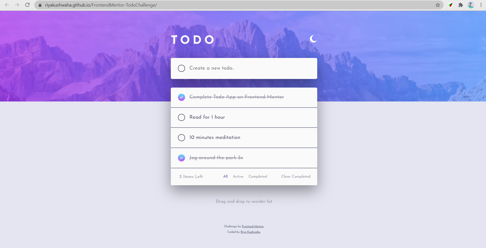

# Frontend Mentor - Todo App Challenge Solution

This is a solution to the [Frontend Mentor - Todo app](https://www.frontendmentor.io/challenges/todo-app-Su1_KokOW). Frontend Mentor challenges help you improve your coding skills by building realistic projects. 

## Table of contents

- [Overview](#overview)
  - [The challenge](#the-challenge)
  - [Links](#links)
  - [Screenshot](#screenshot)

- [My process](#my-process)
  - [Built with](#built-with)
  - [What I learned](#what-i-learned)
  - [Useful resources](#useful-resources)
- [Author](#author)

## Overview

### The challenge

Users should be able to:

- ✅ View the optimal layout for the app depending on their device's screen size
- ✅ See hover states for all interactive elements on the page
- ✅ Add new todos to the list
- ✅ Mark todos as complete
- ✅ Delete todos from the list
- ✅ Filter by all/active/complete todos
- ✅ Clear all completed todos
- ✅ Toggle light and dark mode
- ✅ **Bonus**: Drag and drop to reorder items on the list 🎉

### Links

- [Solution URL](https://www.frontendmentor.io/solutions/flexbox-grid-saas-AEygVp0mZ)
- [Live Site URL](https://riyakushwaha.github.io/FrontendMentor-TodoChallenge/)

### Screenshot

## My process

### Built with

- Semantic HTML5 markup
- CSS custom properties and Sass
- Flexbox
- CSS Grid
- Desktop-first workflow

### What I learned

This challenge helped to test out my developemnt skills. I have used a lot of JavaScript concepts here that were known to me but I ahve used practically like bubbling. It helped my revised and learn about new CSS properties. I also managed to implement the Block, Element, Modifier methodology (commonly referred to as BEM) which is a popular naming convention for classes in HTML and CSS and this made my work a lot easioer in JavaScript. On the whole this challenge was all about learning new techniques and revising previous ones. I feel great to have landed on this site and starting this challenge.

### Useful resources

- [CodePen: Drag & Drop List Items](https://codepen.io/retrofuturistic/pen/tlbHE?editors=0010) - This is an amazing codepen which helped me to understand drag and drop API. I'd recommend it to anyone still learning this concept.
- [The Markdown Guide](https://www.markdownguide.org/) - This reference guide helped in writing the markdown.

## Author

- LinkedIn - [Riya Kushwaha](https://www.linkedin.com/in/riyakushwaha)
- Twitter - [@riyakushwaha20](https://www.twitter.com/yourusername)
- Frontend Mentor - [@riyakushwaha](https://www.frontendmentor.io/profile/yourusername)
